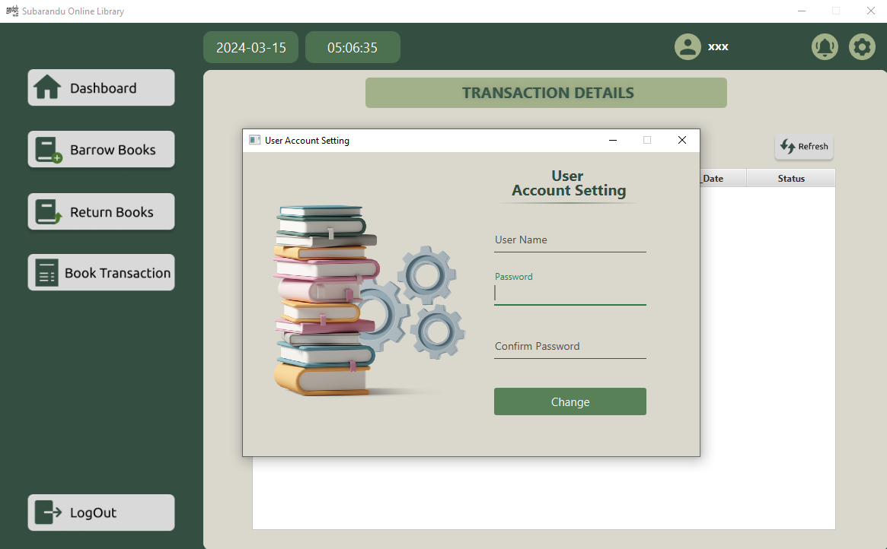
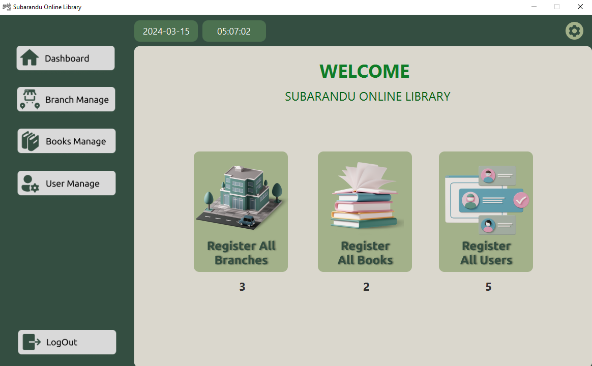
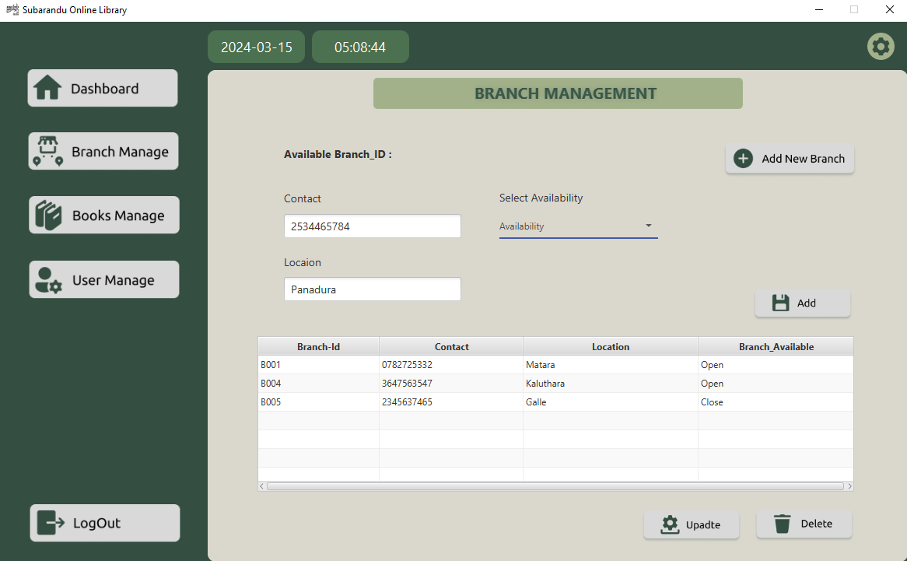
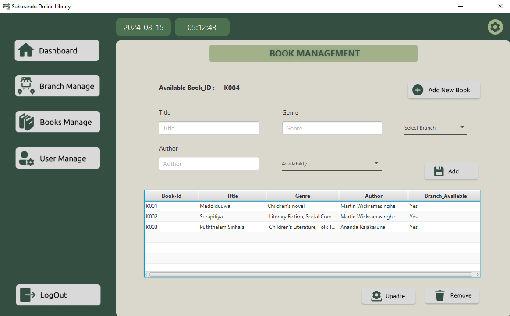
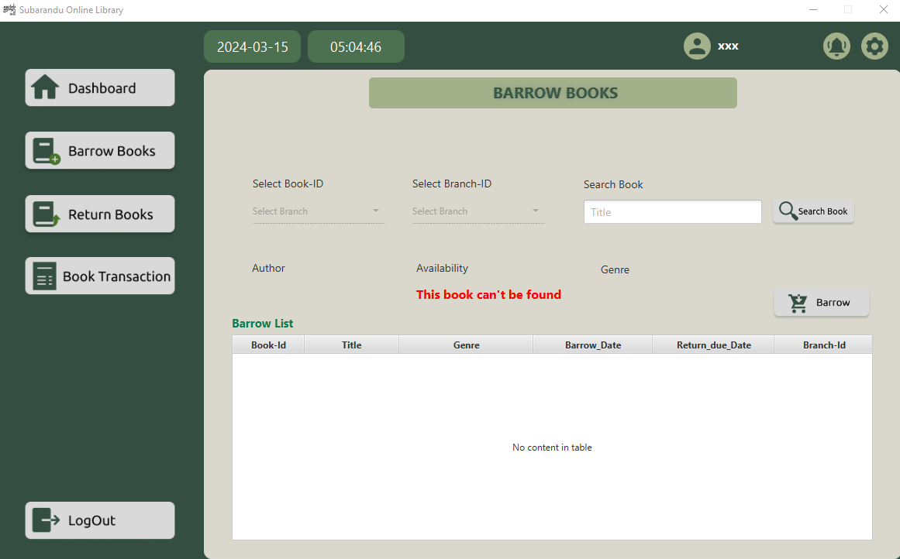
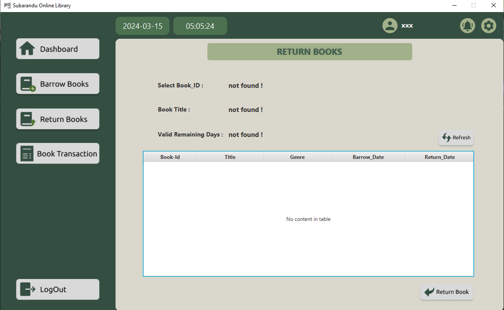
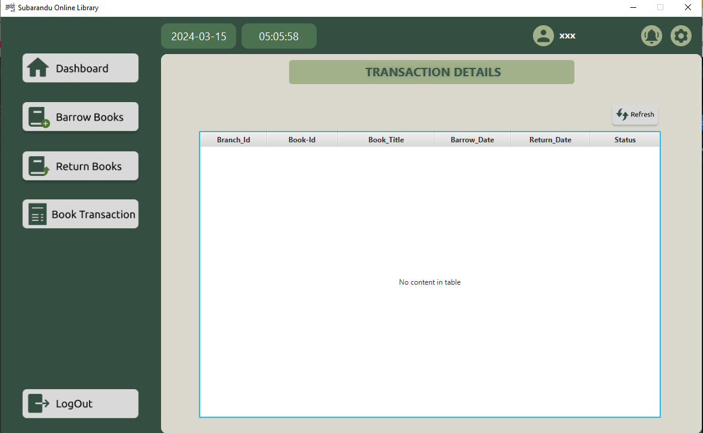

# Hibernate Framwork-Online Library Management System

Welcome to the Introduction to Hibernate Framwork Project ! This project is developed for  Library Management System using Hibernate Framwork concepts

### Introduction

Hibernate is a Java framework that simplifies database interaction by mapping Java objects to database tables, streamlining data persistence and offering features like automatic table creation and querying with HQL.

### Prerequisites

Before you begin, ensure you have met the following requirements:

- Java Development Kit 11 (JDK) installed.
- Install hibernate Framework (Lib) 5.6.15 or Using pom.xml dependencies(Include Dependencies this projec)
- Integrated Development Environment (IDE) like IntelliJ IDEA or Eclipse.
- Git for version control.
- MySQL or another relational database management system installed.

- 📌JavaFX: A framework for building desktop applications with a rich user interface.
- 📌Hibernate Framwork: Java framework that simplifies the development of Java application to interact with the database.
- 📌HQL Query
- 📌JFoenix: A JavaFX library providing stylized buttons and UI components.

### Database Setup

## Usage

To run the project, follow these steps:

1. Open the project in your IDE.
2. Build and run the application.
3. Run Launcher Class

## Project View Sample
#### LOGIN PREVIEW

#### REGISTER PREVIEW

#### ADMIN PREVIEW

#### BRANCH MANAGE PREVIEW

#### BOOK MANAGE PREVIEW

#### BOOK BARROW PREVIEW

#### BOOK RETURN PREVIEW

#### TRANSACTION PREVIEW

